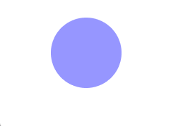
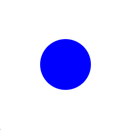

<h1 align="center" style="font-size:60px;font-weight:bolder">ract.js</h1>

<h4 align="center">

[![Downloads][npm-downloads-src]][npm-downloads-href]
[![Version][npm-version-src]][npm-version-href]

</h4>

<h3 align="center">produce animation with functional programming</h3>

---

English | [中文](https://r1ader.gitbook.io/ractjs_cn/)

Notice:

`ract.js` is in its infancy.

Welcome your suggestion to me with issue or <a href="mailto:r1ader.v1@gmail.com?">email</a>

[npm-downloads-src]: https://img.shields.io/npm/dt/ractjs.svg?style=flat&color=darkgreen
[npm-downloads-href]: https://www.npmjs.com/package/ractjs

[npm-version-src]: https://img.shields.io/npm/v/ractjs/latest.svg?style=flat&color=darkorange&label=version
[npm-version-href]: https://www.npmjs.com/package/ractjs

---

## Installation

### npm:
```bash
npm install --save ractjs 
```

### Browser:
Mainstream browsers such as chrome and firefox already support import natively

```html
<script type="module">
    import { r, act } from "https://unpkg.com/ractjs/index.js";
</script>
```
how to use ract.js in native html and javascript ? 👉
[[code](https://github.com/r1ader/ractjs/blob/main/code/test.html)][[demo](https://r1ader.github.io/r_animate/code/test.html)]


## Document

### [GET START](https://r1ader.gitbook.io/ractjs/get_start)

### [API DOC](https://r1ader.gitbook.io/ractjs/api_doc)


## Example

#### Example1：Fade in and out



You can check and run [the completed App.vue](https://stackblitz.com/edit/vue-ufvvux) in `Playground`

or , check [the completed App.vue](https://github.com/r1ader/ractjs/blob/main/code/example_1.vue) in `Github`

```javascript
 r(this.$refs.circle).act(act.FADE_OUT).act(act.FADE_IN);
```

---

#### Example2：Zoom




You can check and run [the completed App.vue](https://stackblitz.com/edit/vue-zpshvy) in `Playground`

or , check [the completed App.vue](https://github.com/r1ader/ractjs/blob/main/code/example_2.vue) in `Github`

```javascript
// App.vue
// ...
// key code
r(this.$refs.circle)
    .act({
        transform: 'scale([1~2])',
        duration: 2000,
    })
    .act({
        transform: 'scale([2~1])',
        duration: 2000,
    });
//...
```

---

#### Example3：Drop simulation


You can check and run [the completed App.vue](https://stackblitz.com/edit/vue-fdkv5z) in `Playground`

or , check [the completed App.vue](https://github.com/r1ader/ractjs/blob/main/code/example_3.vue) in `Github`
